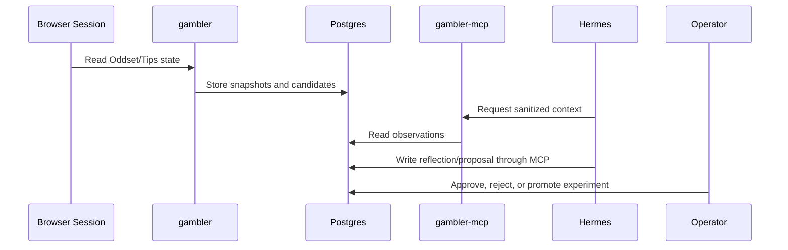

# Hermes Agent And Gambler Loop

This document adapts the `rust_daytrader` Hermes pattern to Danske Spil. The core change is stronger gating: Hermes may learn from observations and propose strategy changes, but it must not control the browser or place bets.

## Roles

- `gambler`: reads site state, builds candidate coupons, scores strategies, and writes observations.
- `gambler-mcp`: exposes a narrow, sanitized tool surface to Hermes.
- `hermes-agent`: reflects on outcomes and proposes one-variable experiments.
- Operator: decides whether to approve experiments and, if ever enabled, any real-money action.

## Initial Goal Contract

```yaml
hermes_self_improvement:
  enabled: false
  mode: recommend_only
  goal_version: 1
  objective:
    optimize_metric: simulated_expected_value
    secondary_metric: calibration_error
    max_drawdown_simulated: 0.10
    min_sample_size_settled_bets: 100
    reflection_every: 7d
    one_variable_only: true
  constraints:
    allow_real_money_placement: false
    require_human_approval: true
    require_terms_review_before_live: true
    require_backtest_before_paper: true
    require_paper_observation_before_live: true
    max_single_stake_dkk: 0
    max_daily_stake_dkk: 0
    no_chasing_losses: true
  forbidden:
    - browser_control
    - read_credentials
    - read_browser_cookies
    - submit_bets
    - deposit_or_withdraw
    - mutate_account_settings
    - bypass_site_controls
```

## Experiment Rule

Hermes must change exactly one independent variable per experiment when `one_variable_only` is true.

Examples that fit:

- Minimum estimated edge: `0.04 -> 0.05`
- Max legs per coupon: `5 -> 4`
- Exclude live markets: `false -> true`
- Confidence prompt wording for injury/news uncertainty

Examples that do not fit:

- Change edge threshold and staking at the same time.
- Change both Oddset market filters and Tips coupon construction.
- Change model prompt, bankroll policy, and event universe in one proposal.

## Safe MCP Tool Surface

Initial tools should be read-mostly:

- `get_capabilities`
- `get_recent_odds_snapshots`
- `get_recent_tips_coupons`
- `get_candidate_bets`
- `get_settlement_observations`
- `list_reflections`
- `create_reflection`
- `list_experiments`
- `create_experiment_proposal`

Forbidden tools:

- Any browser click/type/navigate primitive.
- Any credential, cookie, or session export.
- Any final bet submission.
- Any Kubernetes secret mutation.

## Data Flow



## Promotion Gate

An experiment can become a baseline only after:

- It changes exactly one variable.
- It has replay/backtest evidence.
- It has enough settled observations.
- It does not increase responsible-gambling risk.
- It is approved by the operator.
- It does not enable real-money placement by itself.
