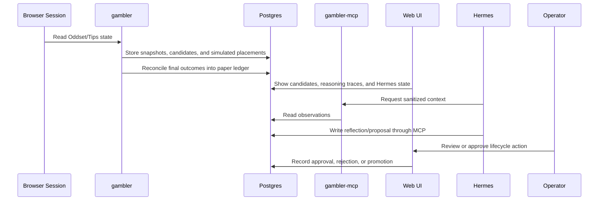

# Hermes Agent And Gambler Loop

This document describes the Hermes and `gambler` learning loop for Danske Spil. The core rule is strong separation: Hermes may learn from observations and propose strategy changes, but it must not control the browser or place bets.

## Roles

- `gambler`: reads site state, builds candidate coupons, scores strategies, and writes observations.
- `gambler`: records simulated bet placements, monitors final outcomes, and maintains the paper ledger.
- `gambler-mcp`: exposes a narrow, sanitized tool surface to Hermes.
- `hermes-agent`: reflects on outcomes and proposes one-variable experiments.
- Operator: decides whether to approve experiments and, if ever enabled, any real-money action.

## Operator Web UI

The `gambler` app should expose a web UI as the primary operator surface.

The odds-selection view should show:

- Current market and coupon observations.
- Candidate bets and candidate Tips coupons.
- Open simulated placements and settled paper results.
- Relevant sport stats, trends, weather, seasonality, news, and availability signals used in the decision.
- Selected odds, estimated probability, implied probability, estimated edge, confidence, and stake suggestion when staking is enabled.
- Rejected alternatives and the reason they were rejected.
- Responsible-gambling checks, local stake limits, and terms/safety gates.
- A structured reasoning trace with evidence, scoring factors, uncertainty, and recommendation.

The UI should not show raw hidden chain-of-thought, credentials, cookies, raw account payloads, or browser session material. "Thinking" in the UI means auditable rationale and decision trace, not private scratchpad text.

The Hermes view should show:

- Recent reflections.
- One-variable experiment proposals.
- Experiment lifecycle status.
- Evidence used by each proposal.
- Approval, rejection, promotion, and rollback history.
- Active baseline context when one exists.

Current POC status:

- `POST /api/hermes/reflect/yesterday` writes an idempotent daily reflection into `hermes_reflections` for the previous Europe/Copenhagen calendar day.
- The daily reflection is paper-only and summarizes scan/performance snapshots, simulated placements, settlement observations, and whether results are ready to evaluate.
- Successful scanner runs refresh the previous-day reflection automatically, using the current ledger status of paper positions created that day so later settlements, voids, refunds, cancellations, and postponed items remain visible in the same daily record.
- If paper placements are still awaiting result review, the reflection explicitly blocks strategy promotion based on unresolved exposure.

## Initial Goal Contract

```yaml
hermes_self_improvement:
  enabled: false
  mode: recommend_only
  goal_version: 1
  objective:
    optimize_metric: simulated_expected_value
    secondary_metric: calibration_error
    max_drawdown_simulated: 0.10
    min_sample_size_settled_bets: 100
    reflection_every: 7d
    one_variable_only: true
  constraints:
    allow_real_money_placement: false
    require_human_approval: true
    require_terms_review_before_live: true
    require_backtest_before_paper: true
    require_paper_observation_before_live: true
    max_single_stake_dkk: 0
    max_daily_stake_dkk: 0
    no_chasing_losses: true
  forbidden:
    - browser_control
    - read_credentials
    - read_browser_cookies
    - submit_bets
    - deposit_or_withdraw
    - mutate_account_settings
    - bypass_site_controls
```

## Experiment Rule

Hermes must change exactly one independent variable per experiment when `one_variable_only` is true.

Examples that fit:

- Minimum estimated edge: `0.04 -> 0.05`
- Max legs per coupon: `5 -> 4`
- Exclude live markets: `false -> true`
- Confidence prompt wording for injury/news uncertainty

Examples that do not fit:

- Change edge threshold and staking at the same time.
- Change both Oddset market filters and Tips coupon construction.
- Change model prompt, bankroll policy, and event universe in one proposal.

## Current POC State

The Rust service now persists the first strategy-learning state directly in Postgres:

- `strategy_baselines`: active paper-only baseline configuration for `poc_ranker_v1`.
- `strategy_experiments`: one-variable proposals with hypothesis, baseline value, proposed value, status, and evidence.
- `web_review_events`: operator review actions for proposals.

The initial baseline is:

```json
{
  "max_decimal_odds": 8.0,
  "min_confidence": 0.10,
  "excluded_market_kinds": [],
  "allow_live_markets": false,
  "paper_only": true,
  "one_variable_only": true
}
```

After scans, the POC can propose a conservative one-variable experiment when the candidate set contains enough risk evidence. Current proposal types are:

- Long-price exposure: `max_decimal_odds: 8.0 -> 6.0`.
- Specialized-market exposure: `excluded_market_kinds: [] -> ["goal", "corners", "half_time", "period_or_quarter", "set_or_game"]`.
- Coupon composition: keep singles only, or propose doubles/triples/accumulators after provider combination rules and paper-ledger settlement coverage are available.

This does not change live behavior automatically. It stays in `proposed` until an operator reviews it in the web UI.

API endpoints:

```text
GET  /api/strategy
POST /api/strategy/experiment/review
```

Allowed review actions are `approve`, `reject`, `replay`, `activate`, `promote`, and `rollback`. Replay stores proposal-vs-baseline evidence without placing paper bets or changing the active baseline. Promotion creates a new active baseline version, but it remains paper-only and does not enable real-money placement.

## Safe MCP Tool Surface

Initial tools should be read-mostly:

- `get_capabilities`
- `get_recent_odds_snapshots`
- `get_recent_tips_coupons`
- `get_candidate_bets`
- `get_sports_feature_context`
- `get_simulated_ledger`
- `get_settlement_observations`
- `list_reflections`
- `create_reflection`
- `list_experiments`
- `create_experiment_proposal`

Forbidden tools:

- Any browser click/type/navigate primitive.
- Any credential, cookie, or session export.
- Any final bet submission.
- Any Kubernetes secret mutation.

## Data Flow



## Promotion Gate

An experiment can become a baseline only after:

- It changes exactly one variable.
- It has replay/backtest evidence.
- It has enough settled observations.
- It does not increase responsible-gambling risk.
- It is approved by the operator.
- It does not enable real-money placement by itself.
