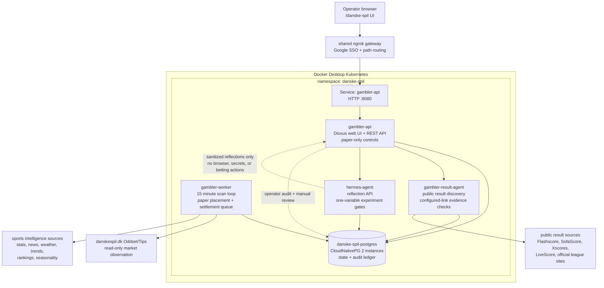

# Kubernetes Architecture

Target cluster: local Docker Desktop Kubernetes.

Target namespace: `danske-spil`.

## Runtime Architecture



The deployed POC keeps browser-facing observation, paper-ledger state,
settlement reconciliation, and Hermes reflection as separate responsibilities:

- `gambler-api` serves the Dioxus operator UI and the internal REST API. It can
  trigger scans, paper entries, result-agent runs, Hermes cycles, and manual
  settlement reviews, but it does not submit bets.
- `gambler-worker` runs the scheduled market scan and paper-ledger maintenance
  loop. It records candidates, simulated placements, expected-finish times,
  lookup due times, and daily performance snapshots.
- `gambler-result-agent` is a separate slim service for automated result
  reconciliation. It discovers public result links, consumes configured
  operator links, grades supported markets, and writes source-backed settlement
  evidence.
- `hermes-agent` reads sanitized strategy and ledger context, writes daily
  reflections, refreshes replay evidence, and blocks promotion while current
  paper performance is provisional or unresolved.
- `danske-spil-postgres` is the shared durable state store for odds snapshots,
  candidates, paper ledger rows, settlement observations, source links, aliases,
  Hermes reflections, audit events, and strategy experiments.

## Workloads

- `gambler-api`: internal API and Dioxus operator web UI for candidate odds,
  paper ledger review, settlement controls, safety gates, audit events, and
  Hermes review.
- `gambler-worker`: scheduled scanner, monitor, sports-data ingestion,
  simulation-placement, and settlement-queue worker.
- `gambler-result-agent`: paper-only result reconciliation service with its own cadence, internal HTTP API, and slim no-Dioxus image.
- `gambler-mcp`: future Hermes-safe MCP adapter.
- `hermes-agent`: Hermes gateway and reflection engine.
- `hermes-weekly-reflection`: suspended CronJob until configured.
- `danske-spil-postgres`: CloudNativePG cluster with two instances.

## Storage

- `danske-spil-postgres`: CNPG PVCs for database state.
- `hermes-data`: PVC mounted at `/opt/data`.
- Optional browser profile PVC should be encrypted or avoided until the session model is understood.

## Secrets

Separate secrets by blast radius:

- `gambler-env`: Danske Spil credentials and browser config. Only `gambler` workloads may mount it.
- `hermes-env`: Hermes/model/API keys. Must not include Danske Spil credentials.
- `danske-spil-postgres-app`: database username, password, and URL.

## CNPG Skeleton

The future manifest should use two CNPG instances:

```yaml
apiVersion: postgresql.cnpg.io/v1
kind: Cluster
metadata:
  name: danske-spil-postgres
  namespace: danske-spil
spec:
  instances: 2
  bootstrap:
    initdb:
      database: danske_spil
      owner: danske_spil
      secret:
        name: danske-spil-postgres-app
  storage:
    size: 5Gi
```

## Network Policy Direction

Start closed and open narrowly:

- `hermes-agent` can call `gambler-mcp`.
- `gambler-mcp` can call Postgres and `gambler-api`.
- `gambler-api` and `gambler-worker` can call Postgres and `danskespil.dk`.
- `gambler-worker` may call configured sports stats, weather, and news sources with source provenance recorded in Postgres.
- `gambler-result-agent` may call documented external result sources only for settlement lookup and only when source metadata is recorded.
- External browser access is owned by the shared ngrok gateway. The `danske-spil`
  namespace exposes only the internal `gambler-api` service; Google SSO and path
  routing live outside this repo.

## Pod Security Baseline

Application workloads should run as non-root UID/GID `65532`, disable service
account token automounting unless a Kubernetes API call is explicitly needed,
drop Linux capabilities, disallow privilege escalation, use
`RuntimeDefault` seccomp, and keep the root filesystem read-only. Each workload
mounts a memory-backed `/tmp` for runtime scratch space and declares conservative
CPU/memory requests and limits.

## Deployment Order

1. Namespace and secrets.
2. CNPG operator if not already installed.
3. Postgres cluster and app secret.
4. `gambler` read-only service.
5. `gambler-mcp`.
6. `gambler-web` after the API and schema are available.
7. Hermes with MCP wait/init check.
8. Suspended CronJob for manual smoke tests.

## Smoke Tests

```bash
rtk kubectl --context docker-desktop -n danske-spil get pods,svc,pvc,cluster
rtk kubectl --context docker-desktop -n danske-spil logs deployment/gambler-api --tail=120
rtk kubectl --context docker-desktop -n danske-spil logs deployment/gambler-web --tail=120
rtk kubectl --context docker-desktop -n danske-spil logs deployment/hermes-agent --tail=120
```
