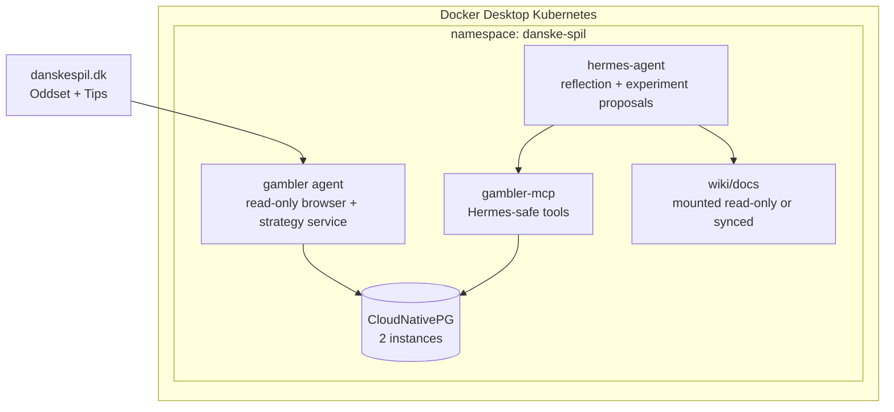

# Project Plan

This plan starts from an empty local repository and aims for a guarded, observable system before any betting-critical behavior exists.

## Constraints Found During Planning

Danske Licens Spil's current net-game terms for the Blue Account state that the company can limit deposits, block accounts, cancel games, and reverse funds for several suspected behaviors. The listed behaviors include applications, robots, or similar mechanisms used to affect or automate play.

That means this project should begin as a research and decision-support system. Any move toward real-money placement needs an explicit human decision after reviewing account, legal, responsible-gambling, and terms-of-service risk.

## Target Shape



## Phase 0: Planning And Knowledge Base

Deliverables:

- Initial docs and wiki scaffold.
- Compliance and safety guardrails.
- Browser investigation runbook.
- Kubernetes architecture plan for namespace `danske-spil`.
- Hermes/gambler goal contract and experiment rules.

Exit criteria:

- The repo has enough durable context that a later implementation session can start without rediscovering the operating model.

## Phase 1: Non-Mutating Browser Investigation

Scope:

- Use `agent-browser` or a Playwright-backed equivalent with a real browser engine and persistent session.
- Learn the Oddset and Tips navigation model.
- Record sanitized selectors, page states, URL transitions, and network/API observations.
- Identify login flow boundaries, MitID/Spil-ID checkpoints, cookie behavior, and bot/automation blocks.
- Stop before final bet submission, deposit, withdrawal, payment, account change, or bonus activation.

Outputs:

- `wiki/sources/danske-spil-dom-observations.md`
- `wiki/concepts/oddset-navigation-model.md`
- `wiki/concepts/tips-navigation-model.md`
- Sanitized screenshots under a future ignored or reviewed artifact directory.

## Phase 2: Read-Only Data Model

Scope:

- Persist odds snapshots, Tips coupons, event metadata, candidate selections, browser-session metadata, and audit events.
- Add deduplication and timestamps so strategy learning can replay observations.
- Store no credentials, cookies, MitID data, or raw personally identifying account payloads in Postgres.

Candidate tables:

- `odds_snapshots`
- `tips_coupons`
- `candidate_bets`
- `candidate_coupons`
- `settlement_observations`
- `dom_observations`
- `browser_session_audit`
- `hermes_reflections`
- `strategy_experiments`
- `risk_limits`

## Phase 3: Gambler Agent

Scope:

- Implement `gambler` as a service that can collect read-only market state, build candidate coupons, score them, and expose sanitized context.
- Expose a narrow `gambler-mcp` adapter for Hermes.
- Keep browser cookies and credentials isolated from Hermes.
- Add dry-run coupon preparation only if it can stop reliably before final submission.

Default mode:

```yaml
gambler:
  mode: observe_only
  allow_real_money_placement: false
  require_human_approval: true
```

## Phase 4: Hermes Agent

Scope:

- Deploy Hermes in the same namespace with its own PVC.
- Allow Hermes to read sanitized context through MCP.
- Allow Hermes to write reflections and one-variable experiment proposals.
- Forbid Hermes from browser control, credential access, Kubernetes secret reads, or bet placement.

## Phase 5: Simulation And Reinforcement Learning

Scope:

- Build a simulation loop from odds snapshots, candidate bets, and settlement observations.
- Let Hermes optimize prompts, thresholds, staking heuristics, or market filters one variable at a time.
- Require backtest/replay evidence and paper observation before any human can promote a baseline.

## Phase 6: Human-Approved Action Surface

This phase is intentionally gated. It should not start until the compliance document is reviewed.

Possible scope after review:

- A UI or CLI that displays a proposed coupon, stake, evidence, and risk impact.
- The human manually confirms or rejects.
- The system records immutable audit events.
- Real-money placement remains disabled by default and must require a deliberate local config change.

## Backlog

- Confirm whether Danske Spil offers any official API, affiliate feed, or export surface for odds/history.
- Decide whether `gambler` runtime should be Python-first for browser automation or Rust-first for parity with `rust_daytrader`.
- Design the first Postgres schema migration.
- Create Kubernetes manifests and deploy script after the first non-mutating implementation exists.
- Add qmd collections once the wiki grows beyond the initial scaffold.
