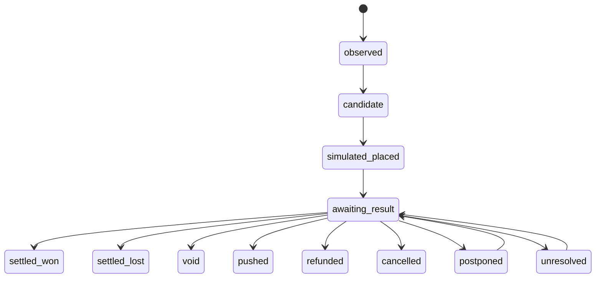

# Simulation Ledger

`gambler` should not submit bets, but it should behave as if it had taken selected bets so the strategy can be evaluated honestly.

The simulation ledger is the source of truth for paper placements, exposure, settlement, and simulated profit/loss.

## Responsibilities

`gambler` should:

- Scan Oddset and Tips on a configured schedule.
- Monitor odds, coupons, disabled/suspended states, and price changes.
- Select candidate bets or coupons using the active simulation strategy.
- Record simulated placements at the observed odds and timestamp.
- Track hypothetical stake, exposure, and rationale.
- Look up final outcomes later.
- Grade each simulated bet as won, lost, void, pushed, cancelled, unresolved, or partially settled.
- Compute simulated return and profit/loss.

## Non-Goals

- No real-money bet submission.
- No deposit, withdrawal, bonus, or account-setting automation.
- No rewrite of simulated entry odds after the fact.
- No settlement based only on model opinion.

## Lifecycle



## Simulated Placement Record

Each simulated placement should record:

- Product: Oddset or Tips.
- Event, market, selection, and coupon leg metadata.
- Coupon type: single, double, triple, or larger accumulator.
- Provider combination-rule evidence, including min/max accumulator legs and same-sport or same-category requirements.
- Observed odds and observed timestamp.
- Hypothetical stake.
- Strategy baseline id.
- Reasoning trace id.
- Browser observation id or snapshot id.
- Local safety gates that passed or failed.
- Placement status and settlement status.

The observed odds are immutable. If the site later changes the odds, that becomes a new observation and may affect future candidates, not the old simulated placement.

## Settlement Lookup

Outcome lookup should prefer sources in this order:

1. Danske Spil settlement, history, result, or coupon status pages if accessible without submitting bets or exposing sensitive account payloads.
2. Official league, tournament, or event result sources.
3. Flashscore match result pages when a stable match URL is available for football, tennis, or basketball.
4. Sofascore or LiveScore match result pages when a stable match URL is available and source reliability is recorded. Local testing showed Sofascore blocks direct HTTP even with browser-like headers, while `agent-browser` can load the page, so Sofascore is currently a browser-automation evidence source rather than a reqwest auto-settlement source.
5. Documented third-party result sources, only when source reliability is recorded.

The POC seeds these source classes into `source_registry` as settlement-capable
sources and exposes them through `GET /api/settlement/sources`. They are policy
records, not credentials or browser sessions.

Browser-only sources can submit structured result evidence through:

```text
GET  /api/result-agent/queue
POST /api/settlement/external-evidence
GET  /api/settlement/external-evidence
POST /api/settlement/source-link
GET  /api/settlement/source-links
```

`GET /api/result-agent/queue` is the normal automation entry point for stale
paper positions. It converts due settlement-review rows into read-only result
tasks with event context, expected finish timing, source links, deterministic
search terms, and the recommended next agent action. It does not expose
credential values, cookies, account payloads, or browser storage.

The POST endpoint stores source URL, match names, final score, confidence, and a short browser text excerpt in `external_result_evidence`. When `settle` is true, it settles only matching open single-leg winner markets whose selected outcome maps deterministically to home, away, or draw.

`POST /api/settlement/source-link` stores operator-provided public result URLs in
`external_result_links` instead of mutating seeded source-policy payloads. The
link is merged into settlement-review source policy responses on read, so it
survives app restarts and schema bootstrap refreshes. Accepted source keys are
`flashscore_results`, `sofascore_results`, and `livescore_results`, with host
validation before the URL is persisted.

`GET /api/settlement/source-links` lists the operator-managed result links for
audit and UI review.

For browser-backed public match pages, run the local evidence probe from a
workstation that has access to the API, usually through a short-lived
port-forward. The probe supports Sofascore, Flashscore, and LiveScore source
keys, and it can be used with explicit score arguments when a page does not
expose a parseable final score:

```text
rtk kubectl --context docker-desktop -n danske-spil port-forward svc/gambler-api 18083:8080
scripts/external_result_evidence_probe.py \
  "https://www.sofascore.com/da/tennis/match/katarina-kujovic-andreea-diana-soare/FtiesyjFg" \
  --event-name "Andreea Diana Soare - Katarina Kujovic" \
  --home-name "Andreea Diana Soare" \
  --away-name "Katarina Kujovic" \
  --dry-run
```

The probe defaults to `settle=false`; add `--settle` only when the extracted
payload has been reviewed and deterministic settlement is intended.

For configured public result URLs, the local result agent can consume the queue
and run browser evidence collection without prompting for URLs:

```text
rtk python3 scripts/result_agent.py --api http://127.0.0.1:18083 --browser-only --dry-run
```

The Danske Spil account-history path should be implemented as the same kind of
local read-only browser agent: use an authenticated operator session, inspect
settled coupon/account history, and post only sanitized settlement evidence.

Every settlement observation should record:

- Source name and URL pattern.
- Observed result.
- Observed timestamp.
- Expected finish or result-check-after timestamp used to decide when lookup should start.
- Confidence.
- Grading rule used.
- Any ambiguity or manual-review flag.

Ambiguous outcomes should stay unresolved or require operator review. Postponed outcomes remain open exposure and should be rechecked later. The system should not silently guess.

The settlement model must explicitly handle cancelled, postponed, abandoned, voided, pushed, and agency-refunded outcomes. A refund or void should preserve the stake-return rule and source evidence instead of being recorded as an ordinary win or loss.

Current POC status:

- Paper placements are stored in `simulated_bets` with immutable observed odds and stake.
- Manual operator settlement can mark rows as won, lost, void, pushed, refunded, cancelled, postponed, or unresolved through the API.
- Manual settlement writes `settlement_observations` and computed simulated return/profit-loss.
- The web UI shows configured settlement-capable source classes next to the review queue so manual grading can cite an approved source class.
- The web UI and `GET /api/settlement/observations` expose recent settlement observations for audit.
- Settlement review evidence persists the approved source policy order into each paper bet or coupon payload.
- Manual settlement validates the cited source against `source_registry.can_settle` and stores the selected policy record without deleting prior review evidence.
- Automated review refreshes record non-grading `settlement_lookup_attempts` rows for due paper singles and coupons, throttled by `GAMBLER_SETTLEMENT_LOOKUP_COOLDOWN_MINUTES` so UI refreshes do not spam duplicate checks. These rows capture the lookup source, recommendation, current event/outcome state, and the approved settlement source policy so the 15-minute recheck loop is auditable even before automated grading exists.
- Overdue paper singles that are more than 2 hours past the sport-specific expected event finish can be auto-settled only for winner markets when a configured external source URL exposes a parseable final score. For football this means kickoff plus roughly 130 minutes, then another 2 hours before external auto-checking. The settlement observation and `paper_bet_auto_settled_external` audit event preserve the source key, URL, page title, score, selected outcome, and simulated result used as truth.
- Browser-backed source evidence is stored separately in `external_result_evidence` and may create `paper_bet_settled_from_external_evidence` audit events when it drives a deterministic paper settlement.
- Strategy selection is stored in `strategy_candidate_decisions`; rejected candidates are preserved for review but blocked from paper-ledger placement.
- Selected candidates can be auto-paper-placed into `simulated_bets` with per-scan and max-open-exposure caps. This is idempotent per candidate and remains simulation-only.
- Multi-leg coupons are auto-paper-placed only after the active strategy baseline enables the coupon mode and provider accumulator support is verified from observed data.
- Open paper bets move to `awaiting_result` after the event start time has passed. This queues them for result lookup without grading the outcome.
- Open paper bets and paper coupons store the event start time and expected finish timestamp so the operator can see when each simulated position should be reviewed.
- The intended worker cadence is roughly every 15 minutes: scan for new opportunities, auto-place eligible paper bets, queue finished or likely-finished bets, and re-check awaiting-result bets for verified outcomes.
- Each successful scan refreshes the previous Europe/Copenhagen calendar day's Hermes paper reflection so operators can see whether that day's paper positions are still open, awaiting result, settled, voided, refunded, or ready for strategy review.
- Automated result lookup is still pending and should use the source ordering above.

## Metrics

The ledger should support:

- Simulated turnover.
- Simulated return.
- Simulated profit/loss.
- Hit rate.
- Average odds.
- Expected value versus realized result.
- Calibration by probability bucket.
- Drawdown.
- Coupon leg contribution.
- Strategy baseline comparison.

Current POC metrics are exposed through `/api/ledger/summary`:

- Count, open count, and settled count.
- Simulated turnover and open exposure.
- Simulated return and profit/loss.
- Hit rate for decided won/lost rows.
- Average observed odds.
- Status breakdown.

`/api/performance` adds an operational performance and opportunity report:

- Latest scan candidate intake by selected/rejected status.
- Selected but unplaced candidates from the latest snapshot.
- Remaining paper placement capacity and exposure-cap blocker state.
- Awaiting-result items due for review.
- Settlement lookup cadence: due items with recent checks, due items missing a fresh lookup, last lookup time, and next lookup due time.
- Lookup due queue: the oldest due paper singles or coupons that do not have a fresh lookup attempt inside the cooldown window.
- Paper performance by sport and strategy.
- Strategy played summaries include both single simulated bets and multi-leg simulated coupons, with separate single/coupon counts so doubles, triples, and larger accumulators are reflected in paper performance.
- The web UI shows a recent plays feed from the same strategy-played payload so operators can inspect the latest paper singles and coupons behind aggregate metrics.

Each scan records the live report into `simulation_performance_snapshots`.
`/api/performance/history` exposes recent snapshots so operators can compare
exposure, due-settlement workload, placement capacity, and simulated P/L across
scan cycles instead of relying only on the current state.

Auto-paper placement walks a wider ranked selection window than the per-scan
placement limit. This lets it skip opportunities already represented by
existing non-void simulated exposure and still fill the available paper slots
from lower-ranked eligible candidates. The same pattern applies to candidate
coupons through `/api/coupons/simulate/selected`, using the shared exposure cap.

## Data Model

Candidate tables:

- `candidate_coupons`
- `candidate_coupon_legs`
- `simulated_bets`
- `simulated_coupons`
- `simulated_coupon_legs`
- `settlement_observations`
- `settlement_lookup_attempts`
- `settlement_sources`
- `simulation_performance_daily`
- `strategy_baselines`

The POC keeps single-leg bets and multi-leg coupons in separate simulated-ledger tables. Shared metrics combine their open exposure, turnover, simulated return, profit/loss, hit rate, and average observed odds, while coupon rows keep leg-level evidence so a later settlement worker can grade each leg before calculating coupon-level return.

## Web UI Requirements

The UI should show:

- Open simulated placements.
- Awaiting-result items.
- Settled won/lost/void items.
- Simulated P/L by day, product, market, strategy, and confidence bucket.
- Settlement source and confidence.
- Recent non-grading settlement lookup attempts and recommendations.
- Lookup freshness on each settlement-review row, including the last lookup timestamp and whether it is stale relative to the configured cooldown.
- Overdue paper positions that remain unresulted in the Danske Spil content feed for more than 2 hours after the sport-specific expected finish time are escalated to `external_result_required`, with official competition results, Flashscore, Sofascore, LiveScore, and documented third-party results as review sources.
- Manual-review queue for ambiguous results.

All displays must clearly label results as simulated/paper results unless real-money functionality is explicitly approved later.
