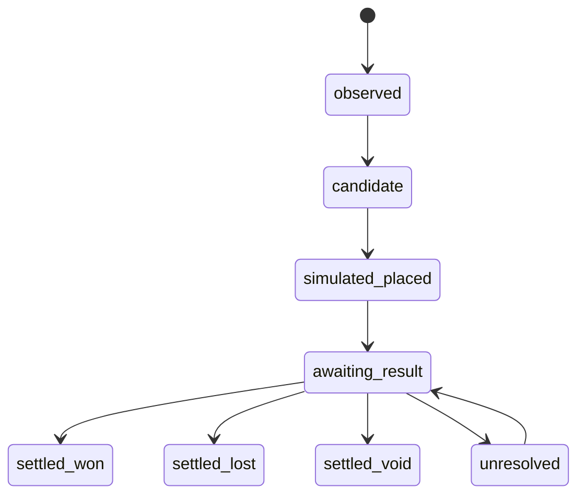

# Simulation Ledger

`gambler` should not submit bets, but it should behave as if it had taken selected bets so the strategy can be evaluated honestly.

The simulation ledger is the source of truth for paper placements, exposure, settlement, and simulated profit/loss.

## Responsibilities

`gambler` should:

- Scan Oddset and Tips on a configured schedule.
- Monitor odds, coupons, disabled/suspended states, and price changes.
- Select candidate bets or coupons using the active simulation strategy.
- Record simulated placements at the observed odds and timestamp.
- Track hypothetical stake, exposure, and rationale.
- Look up final outcomes later.
- Grade each simulated bet as won, lost, void, pushed, cancelled, unresolved, or partially settled.
- Compute simulated return and profit/loss.

## Non-Goals

- No real-money bet submission.
- No deposit, withdrawal, bonus, or account-setting automation.
- No rewrite of simulated entry odds after the fact.
- No settlement based only on model opinion.

## Lifecycle

## Simulated Placement Record

Each simulated placement should record:

- Product: Oddset or Tips.
- Event, market, selection, and coupon leg metadata.
- Coupon type: single, double, triple, or larger accumulator.
- Provider combination-rule evidence, including min/max accumulator legs and same-sport or same-category requirements.
- Observed odds and observed timestamp.
- Hypothetical stake.
- Strategy baseline id.
- Reasoning trace id.
- Browser observation id or snapshot id.
- Local safety gates that passed or failed.
- Placement status and settlement status.

The observed odds are immutable. If the site later changes the odds, that becomes a new observation and may affect future candidates, not the old simulated placement.

## Settlement Lookup

Outcome lookup should prefer sources in this order:

1. Danske Spil settlement, history, result, or coupon status pages if accessible without submitting bets or exposing sensitive account payloads.
2. Official league, tournament, or event result sources.
3. Documented third-party result sources, only when source reliability is recorded.

Every settlement observation should record:

- Source name and URL pattern.
- Observed result.
- Observed timestamp.
- Expected finish or result-check-after timestamp used to decide when lookup should start.
- Confidence.
- Grading rule used.
- Any ambiguity or manual-review flag.

Ambiguous outcomes should stay unresolved or require operator review. The system should not silently guess.

The settlement model must explicitly handle cancelled, postponed, abandoned, voided, pushed, and agency-refunded outcomes. A refund or void should preserve the stake-return rule and source evidence instead of being recorded as an ordinary win or loss.

Current POC status:

- Paper placements are stored in `simulated_bets` with immutable observed odds and stake.
- Manual operator settlement can mark rows as won, lost, void, pushed, or unresolved through the API.
- Manual settlement writes `settlement_observations` and computed simulated return/profit-loss.
- Strategy selection is stored in `strategy_candidate_decisions`; rejected candidates are preserved for review but blocked from paper-ledger placement.
- Selected candidates can be auto-paper-placed into `simulated_bets` with per-scan and max-open-exposure caps. This is idempotent per candidate and remains simulation-only.
- Multi-leg coupons are planned but not yet automated. They should only be paper-ledgered after provider accumulator support and category restrictions are verified from observed data.
- Open paper bets move to `awaiting_result` after the event start time has passed. This queues them for result lookup without grading the outcome.
- Open paper bets and paper coupons store the event start time and expected result-check-after timestamp so the operator can see when each simulated position should be reviewed.
- The intended worker cadence is roughly every 15 minutes: scan for new opportunities, auto-place eligible paper bets, queue finished or likely-finished bets, and re-check awaiting-result bets for verified outcomes.
- Automated result lookup is still pending and should use the source ordering above.

## Metrics

The ledger should support:

- Simulated turnover.
- Simulated return.
- Simulated profit/loss.
- Hit rate.
- Average odds.
- Expected value versus realized result.
- Calibration by probability bucket.
- Drawdown.
- Coupon leg contribution.
- Strategy baseline comparison.

Current POC metrics are exposed through `/api/ledger/summary`:

- Count, open count, and settled count.
- Simulated turnover and open exposure.
- Simulated return and profit/loss.
- Hit rate for decided won/lost rows.
- Average observed odds.
- Status breakdown.

## Data Model

Candidate tables:

- `candidate_coupons`
- `candidate_coupon_legs`
- `simulated_bets`
- `simulated_coupons`
- `simulated_coupon_legs`
- `settlement_observations`
- `settlement_sources`
- `simulation_performance_daily`
- `strategy_baselines`

The POC keeps single-leg bets and multi-leg coupons in separate simulated-ledger tables. Shared metrics combine their open exposure, turnover, simulated return, profit/loss, hit rate, and average observed odds, while coupon rows keep leg-level evidence so a later settlement worker can grade each leg before calculating coupon-level return.

## Web UI Requirements

The UI should show:

- Open simulated placements.
- Awaiting-result items.
- Settled won/lost/void items.
- Simulated P/L by day, product, market, strategy, and confidence bucket.
- Settlement source and confidence.
- Manual-review queue for ambiguous results.

All displays must clearly label results as simulated/paper results unless real-money functionality is explicitly approved later.
