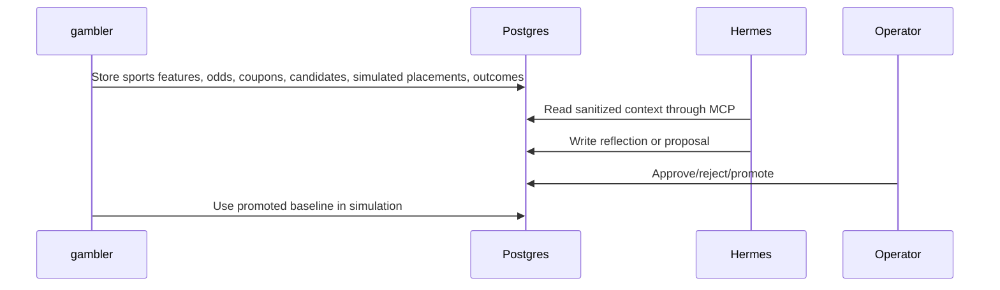

# Hermes Gambler Loop

The safe loop separates observation, strategy learning, and human approval.

## Responsibilities

- `gambler` observes Oddset/Tips state, ingests sports intelligence, stores snapshots, prepares candidate coupons, records simulated placements, and reconciles final outcomes.
- `gambler-mcp` exposes only sanitized read-mostly context to Hermes.
- Hermes writes reflections and one-variable experiment proposals.
- The operator approves, rejects, or promotes experiments.

## Control Boundary

Hermes cannot:

- Control the browser.
- Read credentials or cookies.
- Submit bets.
- Deposit or withdraw funds.
- Change account settings.
- Increase site limits.
- Mutate Kubernetes secrets.

## Learning Loop

## Current POC

- `strategy_baselines` stores the active paper-only `poc_ranker_v1` baseline.
- `strategy_experiments` stores one-variable proposals with evidence.
- `web_review_events` stores operator lifecycle actions.
- Scan-derived proposals can lower `max_decimal_odds` from `8.0` to `6.0` when long-price candidate risk is high, or exclude specialized markets while settlement and feature coverage are still limited.
- Promotion creates a new paper-only baseline version; it does not enable real-money placement.

## Related

- [browser automation investigation](browser-automation-investigation.md)
- [research-first decision](../decisions/0001-research-first-human-approved.md)
