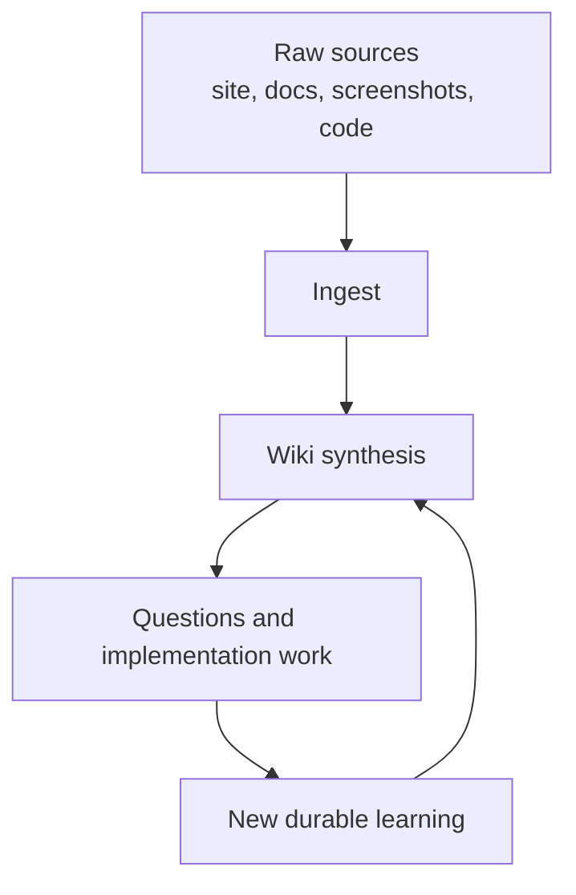

# LLM-Maintained Project Wiki

The wiki is the durable knowledge layer for this repository. It should compound browser findings, safety decisions, architecture notes, and Hermes experiment results across sessions.

## Why It Matters Here

The project will accumulate knowledge that is easy to lose:

- Oddset and Tips DOM/navigation details.
- Login/session boundaries.
- Operator dashboard and reasoning-view decisions.
- Terms and responsible-gambling constraints.
- Strategy hypotheses and simulation evidence.
- Kubernetes deployment procedures.

Raw repo search alone would rediscover these facts repeatedly. A maintained wiki lets agents update the synthesis once and reuse it later.

## Operating Model

## Boundaries

The wiki must not store secrets, cookies, raw account payloads, or unapproved betting instructions. It should summarize and link to evidence.

## Related

- [schema](../schema.md)
- [llm-wiki source note](../sources/llm-wiki.md)
- [Hermes gambler loop](hermes-gambler-loop.md)
