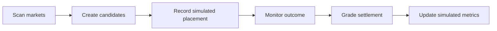

# Simulation Ledger

The simulation ledger lets `gambler` evaluate strategies without submitting bets.

## Core Loop

## Rules

- Simulated placements are immutable.
- Observed odds are locked at the simulated placement timestamp.
- Later odds changes create new observations, not edits to old paper entries.
- Settlement should prefer Danske Spil settlement/result views when available, then official event sources, then documented third-party sources.
- Ambiguous results stay unresolved or require operator review.
- Performance metrics must clearly be labeled simulated.

## Related

- [gambler web UI](gambler-web-ui.md)
- [Hermes gambler loop](hermes-gambler-loop.md)
