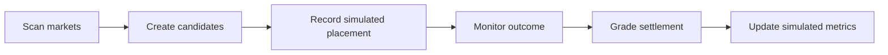

# Simulation Ledger

The simulation ledger lets `gambler` evaluate strategies without submitting bets.

## Core Loop

## Rules

- Simulated placements are immutable.
- Observed odds are locked at the simulated placement timestamp.
- Later odds changes create new observations, not edits to old paper entries.
- Strategies may model singles, doubles, triples, and larger accumulator coupons only when provider rules allow the selected legs to be combined.
- Multi-leg coupons must preserve per-leg odds, combined odds, provider-rule evidence, and leg-level settlement.
- Settlement should prefer Danske Spil settlement/result views when available, then official event sources, then documented third-party sources.
- Ambiguous results stay unresolved or require operator review.
- Each paper bet should track when the match or bet is expected to be finished so result lookup can start at the right time.
- The worker should run roughly every 15 minutes to find new opportunities and re-check queued bets for verified outcomes.
- Cancelled, postponed, abandoned, voided, pushed, and agency-refunded outcomes are distinct settlement states.
- Performance metrics must clearly be labeled simulated.
- Paper placement uses active strategy decisions; rejected candidates remain visible but cannot be simulated.
- Auto-paper placement writes only to the simulation ledger and is capped by per-scan count and open exposure.
- Awaiting-result queueing is separate from settlement grading; it never marks a bet won or lost.

## Related

- [gambler web UI](gambler-web-ui.md)
- [Hermes gambler loop](hermes-gambler-loop.md)
