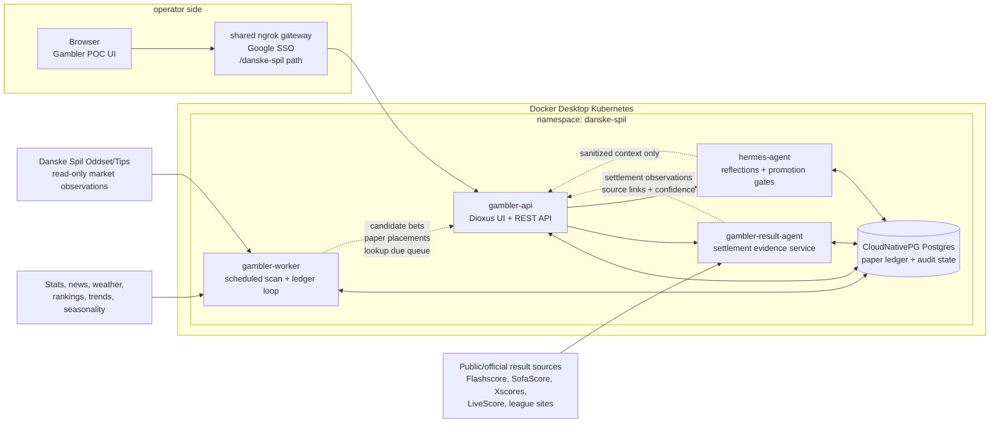

# System Architecture

The POC is split into small services so scanning, result reconciliation,
operator review, and Hermes learning can evolve independently while sharing the
same paper-only Postgres ledger.

## Component Roles

- `gambler-api`: operator-facing surface and REST coordinator. It exposes scans,
  candidate review, paper entries, result-agent controls, settlement review,
  daily performance, Hermes state, audit history, and strategy experiment
  review.
- `gambler-worker`: autonomous scheduler. It scans for new opportunities about
  every 15 minutes, updates expected finish and lookup-due timestamps, keeps the
  paper ledger moving, and refreshes daily performance context.
- `gambler-result-agent`: automated settlement worker. It looks for stable
  public or official result sources, applies alias and home/away matching rules,
  grades supported market types, and records the truth source used for audit.
- `hermes-agent`: paper-only learning loop. It writes daily reflections,
  proposes one-variable experiments, refreshes replay evidence, and blocks
  promotion while results are provisional, unresolved, or insufficiently
  sampled.
- `danske-spil-postgres`: durable state. It stores the normalized market
  observations, aliases, source links, candidates, simulated bets, settlement
  observations, Hermes reflections, audit events, and strategy experiments.

## Safety Boundaries

- Real-money placement remains disabled.
- Hermes cannot access browser sessions, credentials, cookies, Kubernetes
  secrets, or final betting actions.
- Result settlement must record source, confidence, score basis, and audit
  payload before a paper row is considered verified.
- Public result discovery is allowed only for paper-ledger reconciliation and
  should prefer configured or official sources when available.
